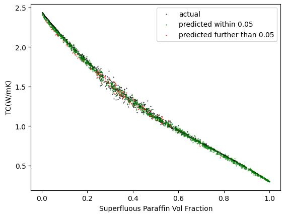

This repo is a CNN(Convolutional Neural Network) model that predicts the thermal conductivity of Paraffin-expanded graphite composites. We generated the dataset using the QSGS(quartet structure generation set) and simulated the corresponding thermal conductivity using the LBM(Lattice Boltzmann Method).

Credit to: Qu, Y., Sun, S., & Zhou, D. (2024). Prediction of thermal conductivity of paraffin-expanded graphite composite phase change materials by machine learning method. Journal of Energy Storage, 101, 113845. https://doi.org/10.1016/j.est.2024.113845

# QSGS
QSGS works by choosing cores at random with a set probability. We then expand the cores after each iteration according to a growth probability. This approach is basically a breadth first search from core nodes with a twist where we only have a chance to branch out to a neighbor. Here are the results generated using the QSGS method and a real image for comparison.

 

# Lattice Boltzmann Method
The Lattice Boltzmann Method(LBM) works by simulating how heat would move through a grid of nodes. In our case we have a 160x160 grid that splits a 1mm by 1mm area. In order to measure thermal conductivity we first set the left side of the image to be hot and the left side to be cold. We keep both of these constant for the entire simulation and make sure that heat
does not flow out the top or bottom of the simulation. To enforce this boundary condition, we send in heat at the same rate that heat is flowing out of the simulation, which makes the simulation act as if heat cannot flow out the top. 

We simulate this until the temperature change before and after an iteration is negligeable, meaning that it has basically hit equilibrium. We calculate the thermal conductivity using net heat flux from left to right at all nodes. 

The details for this simulation can be found in the paper linked at the start. Here are some images of the temperature map at equilibrium when run on that same QSGS sample.

# Model
Our model attempts to predict the output of the LBM. This model allows us to save tons of computation time because the model takes anywhere from 30 second to 30 minutes per image depending on the size of the image and accuracy of the simulation that you want. If you increase the number of directions considered for the LBM or the dimensions, this number can explode into days for each simulation. This model runs basically instantaneously, which allows us to run it on tons of images. This becomes especially useful when we have tons of cross-sectional images of a 3d sample. For this use case we need to run the simulation on thousands of images to aggregate a thermal conductivity prediction.

The model is a basic CNN, with an added multi-layered perceptron that runs alongside the CNN. The input to the MLP is the amount of expanded graphite in the sample. I found that the CNN had a hard time figuring out non-local patterns in the image, so I passed in some properties that take into account the entire image. The output of the CNN and the MLP are then combined in another MLP layer that then outputs a predicted thermal conductivity. Here is how the model performed. These are graphs showing the predicted thermal conductivity and actual thermal conductivity vs the amount of superfluous paraffin there was in the sample.

The first graph is the entire range of inputs, while the second graph is zoomed in on the most volatile interval of the graph.

 
